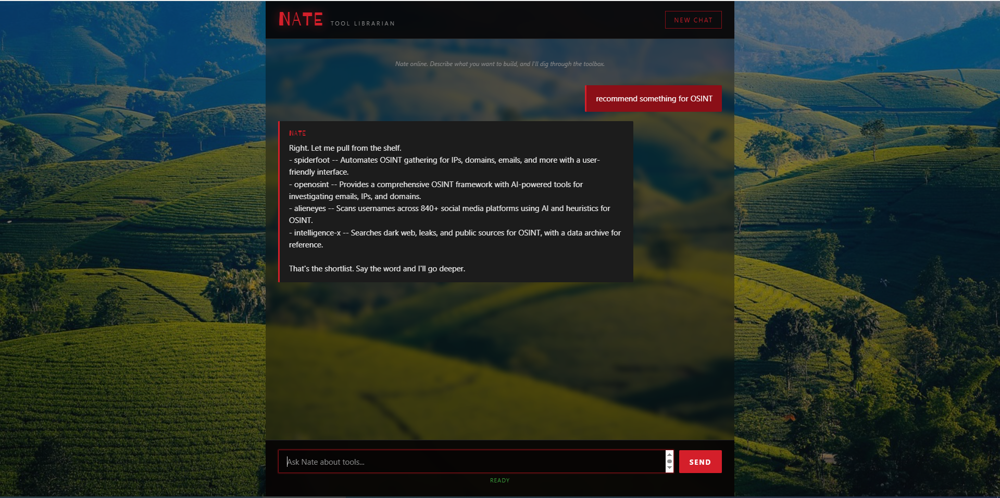
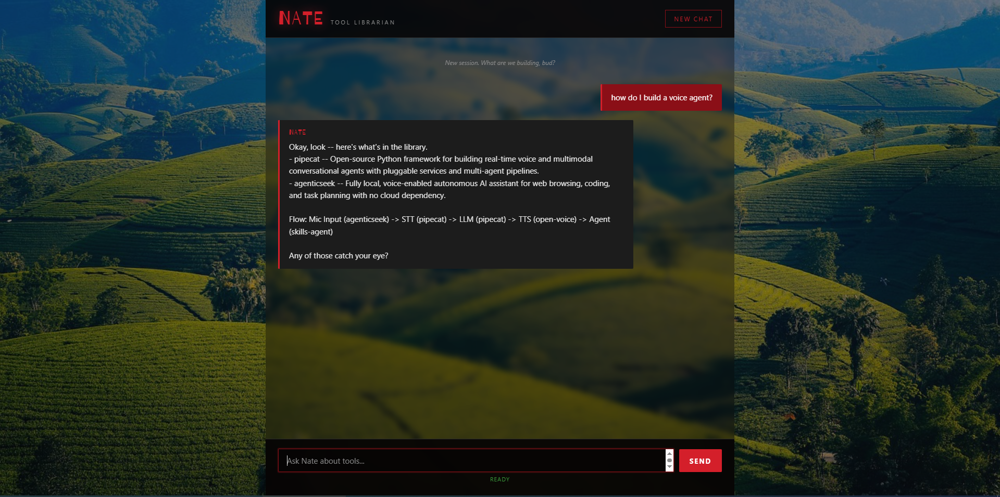
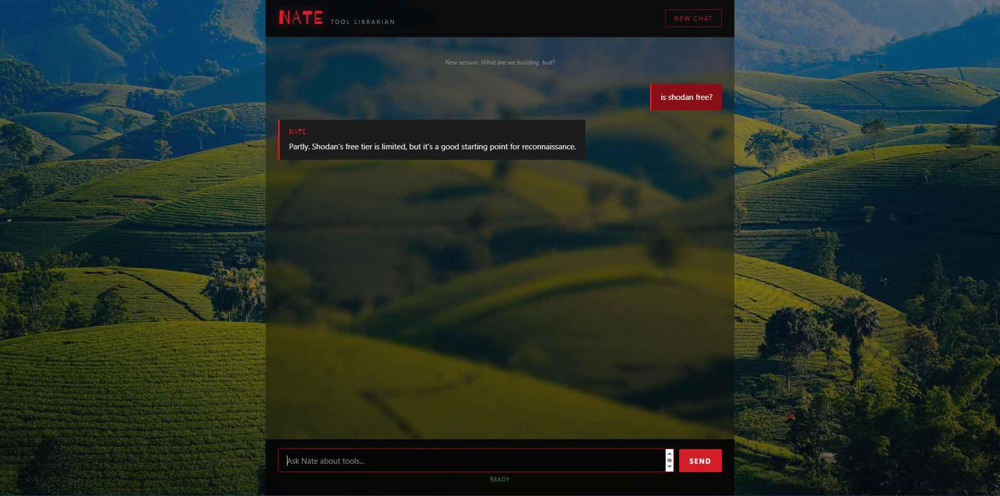
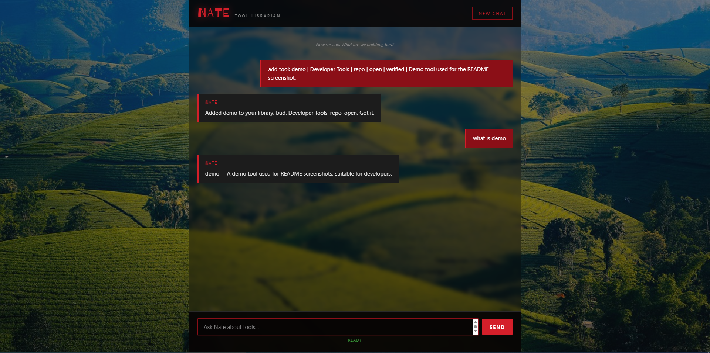

# Nate — Local AI Tool Librarian



A fully offline, private AI tool librarian. Ask what you're building, it recommends from a curated library of 235 tools, draws you a pipeline diagram for multi-tool questions, checks facts, and answers in the voice of a cocky, witty Nathan-Drake-flavored assistant.

Runs entirely on your own machine. No cloud APIs, no telemetry, no accounts.

---

## What it does

Nate routes every message through a **5-mode intent system** and answers in character:

| Mode | Triggers on | Example |
|---|---|---|
| `chat` | Greetings, small talk, or when no tool is close enough | "hey what's up" |
| `recommend` | "what should I use for X", "recommend something for Y" | "recommend something for OSINT" |
| `howto` | "how do I build X", "pipeline", "connect" | "how do I build a voice agent?" |
| `define` | "what is X" where X is a library tool | "what is pipecat?" |
| `factcheck` | yes/no or attribute questions about a specific tool | "is shodan free?" |

**Add tools on the fly** — just type `add tool: name | category | type | pricing | verified | description`. It's embedded immediately and usable in the next message.

---

## Stack

- **LLM:** Ollama + llama3.1:8b (local)
- **Embeddings:** nomic-embed-text via Ollama
- **Vector DB:** ChromaDB (local, persistent)
- **API:** Flask on `:5000`
- **UI:** Single-file HTML, red/black DedSec theme

No Docker, no Supabase, no cloud.

---

## Requirements

- Windows 10/11 (tested), Linux/macOS should work
- Python 3.10+
- [Ollama](https://ollama.com) installed
- `llama3.1:8b` and `nomic-embed-text` pulled
- ~8 GB RAM minimum (16 GB recommended)
- GPU optional — runs on CPU, faster with one

---

## Install

```bash
git clone https://github.com/champmoiz/nate-tool-librarian.git D:\Nate
cd D:\Nate\server
pip install -r requirements.txt
ollama pull llama3.1:8b
ollama pull nomic-embed-text
python load-tools.py    # embeds 235 tools — takes 5–15 min first run
python server.py
```

Then open `nate.html` in your browser. Or double-click `start-nate.bat`.

---

## Usage

Open Nate and ask naturally:

- "What tools do you have for making videos with AI?"
- "Recommend something for OSINT"
- "How do I build a voice agent?"
- "Is Shodan free?"
- "I wanna build Jarvis"

Add a tool mid-session:

```
add tool: my-tool | Developer Tools | repo | open | verified | Short description of what it does.
```

Six fields, pipe-separated. It's live in the next message.

---

## Screenshots

**Recommend mode** — natural-language tool discovery:


**Howto mode** — linear pipeline for "how do I build X":



**Factcheck mode** — grounded answers about specific tools:



**Add-tool flow** — add and immediately query:



---

## How it works

Every `/chat` request goes through 6 steps:

1. Extract user message.
2. Check for `add tool:` or `describe X:` commands — handled and returned early.
3. Embed the query and pull top 8 tools from ChromaDB by L2 distance.
4. `router.py` decides the mode using the top distance + keyword patterns + tool-name resolution.
5. Load the per-mode prompt + JSON schema, call Ollama's `/api/chat` with `format=schema`.
6. Buffer the full JSON response, validate, render to text, fake-stream to the browser as NDJSON.

**Temperatures:** chat=0.7 · recommend=0.3 · howto=0.3 · define=0 · factcheck=0

**Thresholds:** if top distance > 1.4, the router falls back to `chat` mode (assumes no tool is close enough).

**Embeddings:** both the writer (`load-tools.py`) and the reader (`retrieval.py`) normalize vectors to unit length before upsert/query. This is required — Ollama returns unnormalized vectors, and mixing normalized and unnormalized vectors inflates L2 distances by 100×.

---

## Adding your own tools

**Option 1 — natural language, in the chat:**
```
add tool: my-tool | Developer Tools | repo | open | verified | Short description.
```
Persists to both ChromaDB and `tools/tools.txt`. Survives restart.

**Option 2 — direct edit:**
Append a line to `tools/tools.txt`:
```
name | category | type | pricing | verified/unverified | description | optional aliases
```

Then re-run `python server/load-tools.py` to re-embed.

**Aliases** (optional 7th field) are additional search terms that help retrieval — useful for cross-cutting concepts. Example: `pipecat` has aliases `voice agent, jarvis, speech pipeline`, so queries about "Jarvis" reach it.

---

## Known issues

- **Jokes only append on recommend/howto modes** (by design — define/factcheck stay clean).
- **Multi-domain queries** like "I wanna build Jarvis" may occasionally fall to `chat` mode if top_distance exceeds the router's 1.4 threshold.
- **Video/music queries** may route to `chat` when the library has no close match.
- **Add-tool flow accepts 6 fields only.** Aliases (7th field) must be added by editing `tools.txt` directly.
- **`start-nate.bat`** launches `server.py` (the 5-mode server). `nate-server.py` and `nate-server-working.py` are legacy single-mode backups kept for reference only.

---

## Architecture

```
nate.html  →  /chat  →  router.py  →  retrieval.py  →  ChromaDB
                          │                              │
                          ▼                              ▼
                     prompts.py  ─────────────►  Ollama (llama3.1:8b)
                          │
                          ▼
                     renderer.py  →  NDJSON stream  →  browser
```

**Files:**

- `server/server.py` — Flask app, `/chat` + `/health` + `/tools/*`
- `server/router.py` — 5-mode intent router
- `server/retrieval.py` — ChromaDB + OllamaEmbeddingFunction + normalizer
- `server/prompts.py` — personality + humor loaders + per-mode prompts
- `server/renderer.py` — response rendering, joke appender
- `server/schemas.py` — JSON schemas per mode
- `server/whitelist.py` — tool name index + `find_tool()`
- `server/load-tools.py` — bulk embedder (run on install, and after tools.txt edits)
- `personality/nate-system-prompt.txt` — main personality prompt
- `personality/humor-pool.txt` — 79 style hints + 111 jokes
- `tools/tools.txt` — the tool library

---

## Roadmap

- v0.2: prettier ASCII box diagrams for howto mode
- v0.2: multi-tool pipeline templates ("Jarvis stack", "RAG stack", etc.)
- v0.3: web UI for browsing the tool library
- v0.3: import/export tool packs

---

## License

MIT — see [LICENSE](LICENSE).